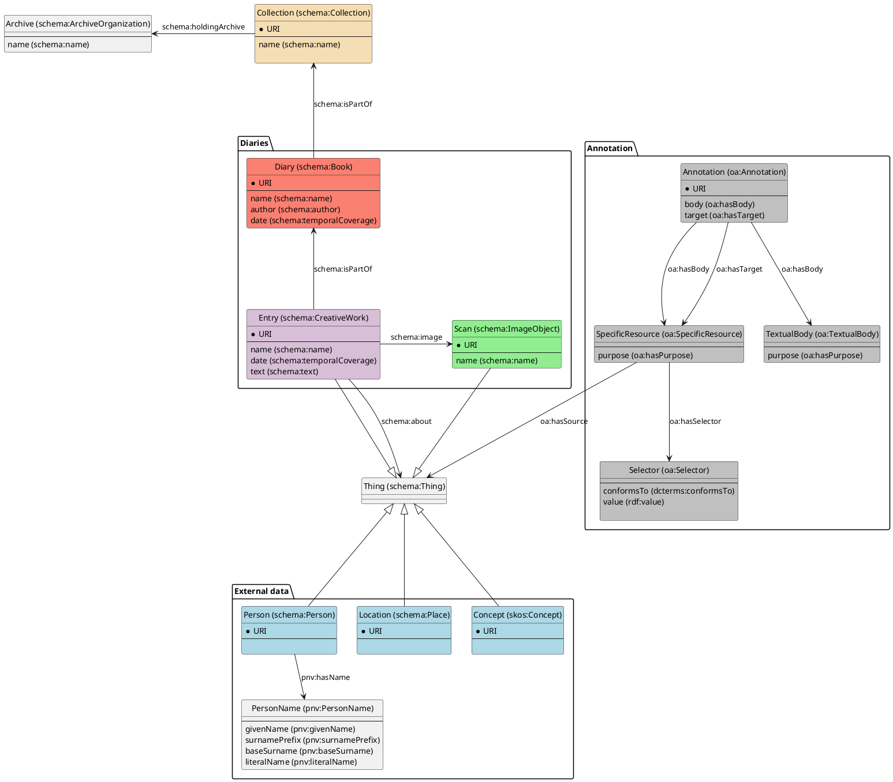

# Amsterdam Diaries Project
Documentation and files for Amsterdam Diaries Project

- [Amsterdam Diaries Project](#amsterdam-diaries-project)
  - [Project Description](#project-description)
  - [Data](#data)
  - [Annotation](#annotation)
    - [Transkribus](#transkribus)
      - [Structural markup (images + text regions and lines)](#structural-markup-images--text-regions-and-lines)
      - [Textual markup](#textual-markup)
      - [Tags (entities)](#tags-entities)

## Project Description

## Data

### Source data

### Data model

## Annotation

### Transkribus
We load the data in Transkribus and run a basic layout analysis over the pages using their `Transkribus LA` model.
#### Structural markup (images + text regions and lines)

* Visual
* Header
* Heading
* Paragraph
* Page number

#### Textual markup

* Strikethrough

#### Tags (entities)

* Date
* Person
* Place

