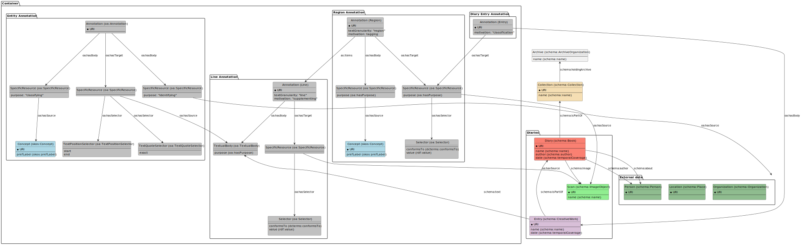

# Model

## Collection
```json
{
  "@context": {"@vocab": "https://schema.org/"},
  "@type": "Collection",
  "name": "",
  "holdingArchive": {
    "@type": "ArchiveOrganization",
    "name": ""
  }
}
```

## Organization

```json
{
  "@context": {
    "@vocab": "https://schema.org/", 
    "archiveHeld": {"@reverse": "holdingArchive"}, 
    "hasPart": {"@reverse": "isPartOf"}
  },
  "@type": "ArchiveOrganization",
  "name": "",
  "archiveHeld":{
    "@type": "Collection",
    "name": "",
    "hasPart": {
      "@type": "Book",
      "name": ""
    }
  }
}
```

## Person

## Diary (Book)


## Entry (Manuscript)

## Image

## Annotations

### Region

### Line

### Entry (Annotation)

### Entity

## PlantUML

```plantuml
@startuml
hide circle

'Classes

class Archive as "Archive (schema:ArchiveOrganization)" {
--
name (schema:name)
}

class Collection as "Collection (schema:Collection)" #wheat {
* URI
--
name (schema:name)

}

package Diaries {

  class Diary as "Diary (schema:Book)" #salmon {
  * URI
  --
  name (schema:name)
  author (schema:author)
  date (schema:temporalCoverage)
  }
  
  class Entry as "Entry (schema:CreativeWork)" #thistle {
  * URI
  --
  name (schema:name)
  date (schema:temporalCoverage)
  }
  
  class Scan as "Scan (schema:ImageObject)" #lightgreen {
  * URI
  --
  name (schema:name)
  }
  
  Diary --> Scan: schema:image
  


}

package External as "External data" {

class Person as "Person (schema:Person)" #darkseagreen {
* URI
--

}


class Location as "Location (schema:Place)" #darkseagreen{
* URI
--

}

class Organization as "Organization (schema:Organization)" #darkseagreen {
* URI
--

}

}

' Web Annotation stuff

package Container {

package WA_Region as "Region Annotation" {

  class Annotation_Region as "Annotation (Region)" #silver {
      * URI
      --
      textGranularity: "block"
      motivation: tagging
  }
  
  class SpecificResource_Region_Body as "SpecificResource (oa:SpecificResource)" #silver {
  --
  purpose (oa:hasPurpose)
  }
  
  class SpecificResource_Region_Target as "SpecificResource (oa:SpecificResource)" #silver {
  --
  purpose (oa:hasPurpose)
  }
  
  class Selector_Region as "Selector (oa:Selector)" #silver {
  --
  conformsTo (dcterms:conformsTo)
  value (rdf:value)
  
  }
  
  Annotation_Region ---> SpecificResource_Region_Body: oa:hasBody
  Annotation_Region  ---> SpecificResource_Region_Target: oa:hasTarget
  
  SpecificResource_Region_Target ---> Scan: oa:hasSource
  SpecificResource_Region_Target ---> Selector_Region: oa:hasSelector
  
  class Source_Tag_Region as "Concept (skos:Concept)" #lightblue {
  * URI
  --
  prefLabel (skos:prefLabel)
  }
  
  SpecificResource_Region_Body ---> Source_Tag_Region: oa:hasSource

}

package WA_Line as "Line Annotation" {

  class Annotation_Line as "Annotation (Line)" #silver {
      * URI
      --
      textGranularity: "line"
      motivation: "supplementing"
  }
  
  class TextualBody_Line as "TextualBody (oa:TextualBody)" #silver {
    --
    purpose (oa:hasPurpose)
  }
  
  Entry -u--> TextualBody_Line: schema:text
  
  class SpecificResource_Line as "SpecificResource (oa:SpecificResource)" #silver {
  --
  }
  
  class Selector_Line as "Selector (oa:Selector)" #silver {
  --
  conformsTo (dcterms:conformsTo)
  value (rdf:value)
  
  }
  
  Annotation_Line ---> TextualBody_Line: oa:hasBody
  Annotation_Line ---> SpecificResource_Line: oa:hasTarget
  
  SpecificResource_Line ---> Scan: oa:hasSource
  SpecificResource_Line ---> Selector_Line: oa:hasSelector
  
  Annotation_Region ---> Annotation_Line: as:items

}

package WA_Entry as "Diary Entry Annotation" {

  class Annotation_Entry as "Annotation (Entry)" #silver {
      * URI
      --
      motivation: "classification"
  }
    
  Annotation_Entry ---> SpecificResource_Region_Target: oa:hasTarget
  Annotation_Entry ---> Entry: oa:hasBody

}

package WA_Entity as "Entity Annotation" {

  class Annotation_Entity as "Annotation (oa:Annotation)" #silver {
    * URI
    --
  }

  class TextQuoteSelector as "TextQuoteSelector (oa:TextQuoteSelector)" #silver {
    --
    exact
  }
  
  class TextPositionSelector as "TextPositionSelector (oa:TextPositionSelector)" #silver {
    --
    start
    end
  }
  
  class SpecificResource_Entity_Body_Classifying as "SpecificResource (oa:SpecificResource)" #silver {
    --
    purpose: "classifying"
  }
  
  class SpecificResource_Entity_Body_Identifying as "SpecificResource (oa:SpecificResource)" #silver {
    --
    purpose: "identifying"
  }
  
  class SpecificResource_Entity_Target as "SpecificResource (oa:SpecificResource)" #silver {
    --
  }
  
  class Source_Tag_Entity as "Concept (skos:Concept)" #lightblue {
  * URI
  --
  prefLabel (skos:prefLabel)
  }
  
  SpecificResource_Entity_Body_Classifying ---> Source_Tag_Entity: oa:hasSource
  SpecificResource_Entity_Body_Identifying --l--> External: oa:hasSource
  
  Annotation_Entity ---> SpecificResource_Entity_Body_Classifying: oa:hasBody
  Annotation_Entity ---> SpecificResource_Entity_Body_Identifying: oa:hasBody
  Annotation_Entity ---> SpecificResource_Entity_Target: oa:hasTarget
  
  SpecificResource_Entity_Target ---> TextQuoteSelector: oa:hasSelector
  SpecificResource_Entity_Target ---> TextPositionSelector: oa:hasSelector
  SpecificResource_Entity_Target ---> TextualBody_Line: oa:hasSource

}



}


'Relations

Collection -u-> Archive: schema:holdingArchive

Diary -u--> Collection: schema:isPartOf
Entry -u--> Diary: schema:isPartOf

Diary --> Person: schema:author
Diary --> Person: schema:about


```





